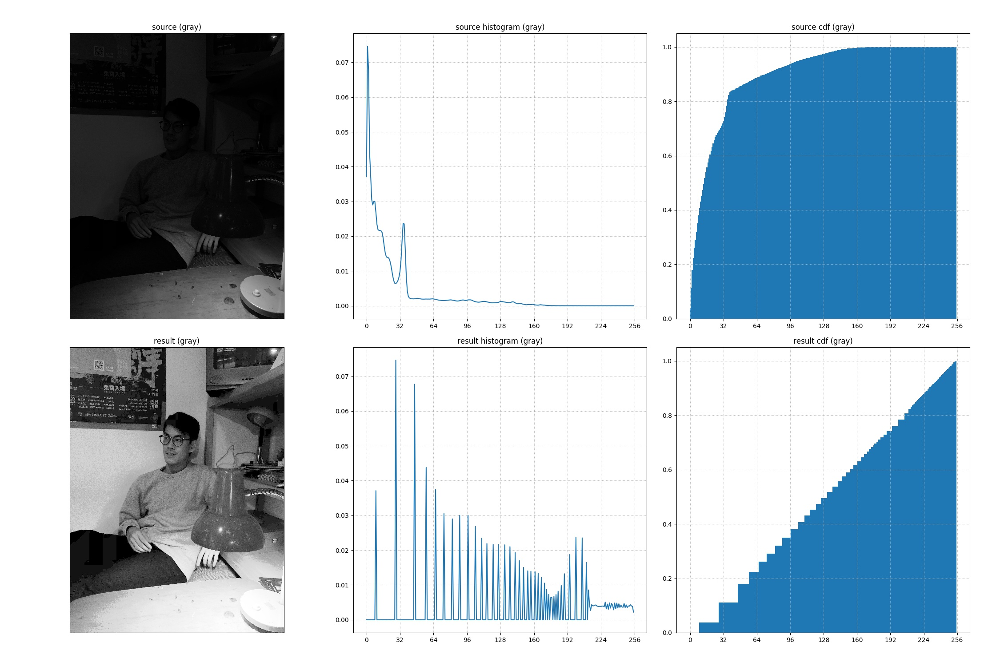

# DIP Homework 2

## 1. Textbook p. 197, prob. 3.6

**Explain why the discrete histogram equalization technique does not yield a flat histogram in general.**

* During discrete histogram equalization, we try to linearize the CDF of pixel intensity frequency distribution by remapping the pixel values. The discrete equalization process merely remaps one intensity value to another, and the number of pixels of each intensities are integers, which means we uses the discrete sum to approximate the coninuous integral. Therefore, it's not guaranteed that the remapped intensity frequencies yields a flat histogram.


## 2. Textbook p. 197, prob. 3.12

**An image with intensities in the range $[0,1]$ has the PDF, $p_r(r)$, shown in the following figure. It is desired to transform the intensity levels of this image so that they will have specified $p_z(z)$ shown in the figure. Assume continuous quantities, and find the transformation (expressed in $r$ and $z$) that will accomplish this.**

* The cumulative normalized histogram of $f$ is defined as follow

$$
{ P }_{ f }\left( r \right) =\int _{ 0 }^{ r }{ { p }_{ f }\left( \omega  \right) d\omega  } 
$$

* The histogram of $r$ and $z$ are

$$
\begin{cases} { p }_{ r }\left( r \right) =-2r+2 \\ { p }_{ z }\left( z \right) =2z \end{cases}
$$

* Compute the normalized CDFs $P_r(r)$ and $P_z(z)$

$$
\begin{eqnarray} { P }_{ r }\left( r \right)  & = & \int _{ 0 }^{ r }{ { p }_{ r }\left( \omega  \right) d\omega  } =\int _{ 0 }^{ r }{ \left( -2\omega +2 \right) d\omega  } =-{ r }^{ 2 }+2r \\ { P }_{ z }\left( z \right)  & = & \int _{ 0 }^{ z }{ { p }_{ z }\left( \omega  \right) d\omega  } =\int _{ 0 }^{ z }{ 2\omega d\omega  } ={ z }^{ 2 } \end{eqnarray}
$$

* To specify the histogram from $r$ to $z$, both normalized CDFs must be the same. Therefore

$$
{ P }_{ z }\left( z \right) ={ P }_{ r }\left( r \right) \Rightarrow { z }^{ 2 }=-{ r }^{ 2 }+2r\Rightarrow z={ \left( -{ r }^{ 2 }+2r \right)  }^{ \frac { 1 }{ 2 }  }
$$


<div style="page-break-after: always;"></div>

## 3. Program

### 3.1. Program introduction

* Apply histogram equalization of specification on images.
* Environments
    * macos 10.14.6
    * python 3.7.4 with `matplotlib`, `numpy`, `opencv-python`

### 3.2. Program usage

* Apply histogram equalization on source image

    ```shell
    python3 histspec.py [image_path]
    ```

* Apply histogram specification on source image given target image

    ```shell
    python3 histspec.py [image_path] --target [target_image_path]
    ```

### 3.3. Demo

