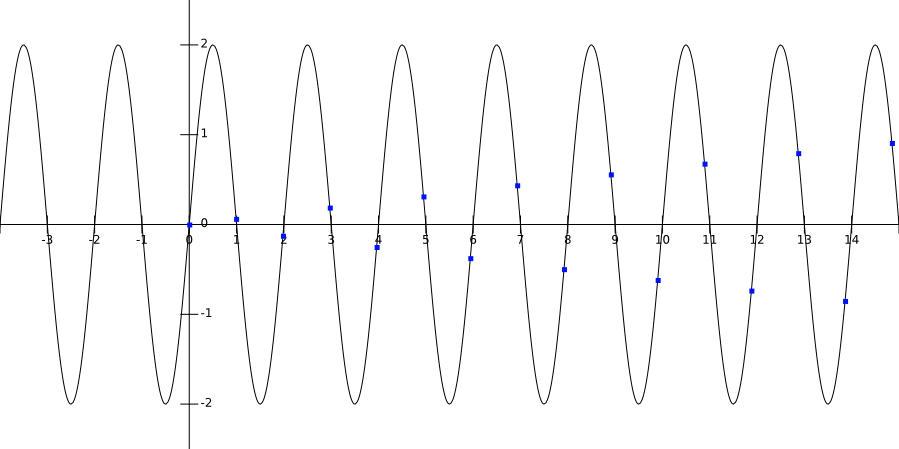

# DIP Homework 3

## 3.28

### (a)

* By the convolution theorem, Fourier transform the convolution of 2 functions in the space domain equals to the product in the frequency domain of the Fourier transforms of the two functions.
* The Fourier transform of a Gaussian

$$
g\left( x \right) =N\left( x;\mu ,{ \sigma  }^{ 2 } \right) \\ F \left\{ g\left( x \right)  \right\} ={ F }_{ g }\left( \omega  \right) =exp\left[ -j\omega \mu  \right] exp\left[ -\frac { { \sigma  }^{ 2 }{ \omega  }^{ 2 } }{ 2 }  \right]
$$

* Therefore, given 2 Gaussian function $g_1$, $g_2$

$$
\begin{eqnarray} { g }_{ 12 }\left( x \right)  & = & { g }_{ 1 }\star { g }_{ 2 } \\  & = & { F  }^{ -1 }\left\{ F \left\{ { g }_{ 1 } \right\} \cdot F \left\{ { g }_{ 2 } \right\}  \right\}  \\  & = & { F  }^{ -1 }\left\{ exp\left[ -j\omega \mu _{ 1 } \right] exp\left[ -\frac { { \sigma  }^{ 2 }_{ 1 }{ \omega  }^{ 2 } }{ 2 }  \right] exp\left[ -j\omega \mu _{ 2 } \right] exp\left[ -\frac { { \sigma  }^{ 2 }_{ 2 }{ \omega  }^{ 2 } }{ 2 }  \right]  \right\}  \\  & = & { F  }^{ -1 }\left\{ exp\left[ -j\omega \left( \mu _{ 1 }+\mu _{ 2 } \right)  \right] exp\left[ -\frac { \left( { \sigma  }^{ 2 }_{ 1 }+{ \sigma  }^{ 2 }_{ 2 } \right) { \omega  }^{ 2 } }{ 2 }  \right]  \right\}  \\  & = & N\left( x;\mu _{ 1 }+\mu _{ 2 },{ \sigma  }^{ 2 }_{ 1 }+{ \sigma  }^{ 2 }_{ 2 } \right)  \end{eqnarray}
$$

* By the equations above, the convolution of 2 Gaussian functions is still a Gaussian function

### (b)

* We denote the composite filter's standard deviation as ${ \sigma  }'$

$$
\begin{eqnarray} { \sigma  }' & = & \sqrt { { \sigma  }^{ 2 }_{ 1 }+{ \sigma  }^{ 2 }_{ 2 }+{ \sigma  }^{ 2 }_{ 3 } }  \\  & = & \sqrt { { 1.5 }^{ 2 }+{ 2 }^{ 2 }+{ 4 }^{ 2 } } =\frac { \sqrt { 89 }  }{ 2 }  \end{eqnarray}
$$

### (c)

* Kernel size changes
    * 3x3 and 5x5 convolution results into 7x7 kernel
    * 7x7 and 7x7 convolution results into 13x13 kernel
* The size of the final filter is 13x13

## 3.38

* Convolution has associativity property, the following is the proof

$$
\begin{align*}
(f\star g)(t)=\int_0^tf(s)g(t-s)ds
\end{align*}
$$

$$
\begin{align*}
{((f\star g)\star h)(t)}&=\int_0^t(f\star g)(s)h(t-s)\,ds\\
&=\int_{s=0}^t\left(\int_{u=0}^sf(u)g(s-u)\,du\right)h(t-s)\,ds\\
&=\int_{s=0}^t\int_{u=0}^sf(u)g(s-u)h(t-s)\,du\,ds\\
&=\int_{u=0}^t\int_{s=u}^tf(u)g(s-u)h(t-s)\,ds\,du\\
&=\int_{u=0}^t\int_{s=0}^{t-u}f(u)g(s)h(t-s-u)\,ds\,du\\
&=\int_{u=0}^tf(u)\left(\int_{s=0}^{t-u}g(s)h(t-u-s)\,ds\right)\,du\\
&=\int_{u=0}^tf(u)(g\star h)(t-u)\,du\\
&\,\,{=(f\star (g\star h))(t)}
\end{align*}
$$

* Therefore, the result should be the same no matter the order of smoothing and Laplacian operations is.

## 4.2

* Apply Fourier transform to $f(t)$

$$
\begin{eqnarray} F\left( u \right)  & = & \int _{ -\infty  }^{ \infty  }{ f\left( t \right) { e }^{ -j2\pi \mu t }dt }  \\  & = & \int _{ 0 }^{ T }{ A{ e }^{ -j2\pi \mu t }dt }  \\  & = & \frac { -A }{ j2\pi \mu  } { \left[ { e }^{ -j2\pi \mu t } \right]  }_{ 0 }^{ T } \\  & = & \frac { -A }{ j2\pi \mu  } \left[ { e }^{ -j2\pi \mu T }-1 \right] =\frac { A }{ j2\pi \mu  } \left[ 1-{ e }^{ -j2\pi \mu T } \right]  \\  & = & \frac { A }{ j2\pi \mu  } \left[ 1-\cos { \left( 2\pi \mu T \right)  } +j\sin { \left( 2\pi \mu T \right)  }  \right]  \end{eqnarray}
$$

* The result has an additional term

$$
\frac { A }{ j2\pi \mu  } \left[ 1-\cos { \left( 2\pi \mu T \right)  }  \right] 
$$

## 4.6	

### (a)

* Sampling rate exceeds the Nyquist rate slightly. 
    * function period = 2, function frequency = 0.5 Hz
    * sampling period = 0.99, sampling frequency ≈ 1.01 Hz (slightly > 1 Hz)

### (b)

* The sampling rate in figure 4.11 is slightly less than 0.5 Hz

### (c)

* I would choose the sampling rate 1 Hz

## 4.17

### (a)

* Define $F(u)$ is the $M$ point DFT of $f(x)$

$$
F\left( u \right) =DFT\left\{ f\left( x \right)  \right\} =\sum _{ x=0 }^{ M-1 }{ f\left( x \right) { e }^{ -j2\pi \mu x/M }dx } 
$$

* We can obtain

$$
\begin{eqnarray} DFT\left\{ f\left( x \right) { e }^{ j2\pi { \mu  }_{ 0 }x/M } \right\}  & = & \sum _{ x=0 }^{ M-1 }{ \left[ f\left( x \right) { e }^{ j2\pi { \mu  }_{ 0 }x/M } \right] { e }^{ -j2\pi \mu x/M }dx }  \\  & = & \sum _{ x=0 }^{ M-1 }{ f\left( x \right) { e }^{ j2\pi \left( { \mu  }_{ 0 }-\mu  \right) x/M }dx }  \\  & = & F\left( { \mu  }_{ 0 }-\mu  \right)  \end{eqnarray}
$$

### (b)

* Define $f(x)$ is the $M$ point IDFT of $F(u)$

$$
f\left( x \right) =IDFT\left\{ F\left( u \right)  \right\} =\frac { 1 }{ M } \sum _{ u=0 }^{ M-1 }{ F\left( u \right) { e }^{ j2\pi \mu x/M }du } 
$$

*  We can obtain

$$
\begin{eqnarray} f\left( x-{ x }_{ 0 } \right)  & = & \frac { 1 }{ M } \sum _{ u=0 }^{ M-1 }{ F\left( u \right) { e }^{ j2\pi \mu \left( x-{ x }_{ 0 } \right) /M }du }  \\  & = & \frac { 1 }{ M } \sum _{ u=0 }^{ M-1 }{ F\left( u \right) { e }^{ -j2\pi \mu { x }_{ 0 }/M }{ e }^{ j2\pi \mu x/M }du }  \\  & = & \frac { 1 }{ M } \sum _{ u=0 }^{ M-1 }{ \left[ F\left( u \right) { e }^{ -j2\pi \mu { x }_{ 0 }/M } \right] { e }^{ j2\pi \mu x/M }du }  \\  & = & IDFT\left\{ F\left( u \right) { e }^{ -j2\pi \mu { x }_{ 0 }/M } \right\}  \end{eqnarray}
$$

* Apply DFT on both sides

$$
\begin{eqnarray} DFT\left\{ f\left( x-{ x }_{ 0 } \right)  \right\}  & = & DFT\left\{ IDFT\left\{ F\left( u \right) { e }^{ -j2\pi \mu { x }_{ 0 }/M } \right\}  \right\}  \\  & = & F\left( u \right) { e }^{ -j2\pi \mu { x }_{ 0 }/M } \end{eqnarray}
$$